# LangChainPro Architecture Diagrams

## 1. System Overview Diagram

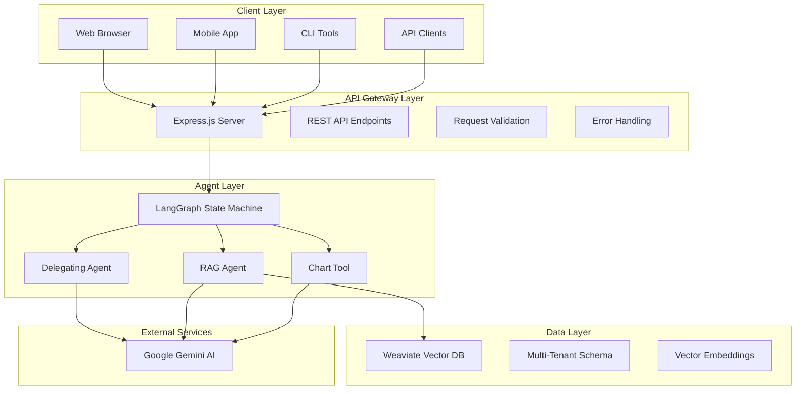

## 2. Agent Decision Flow

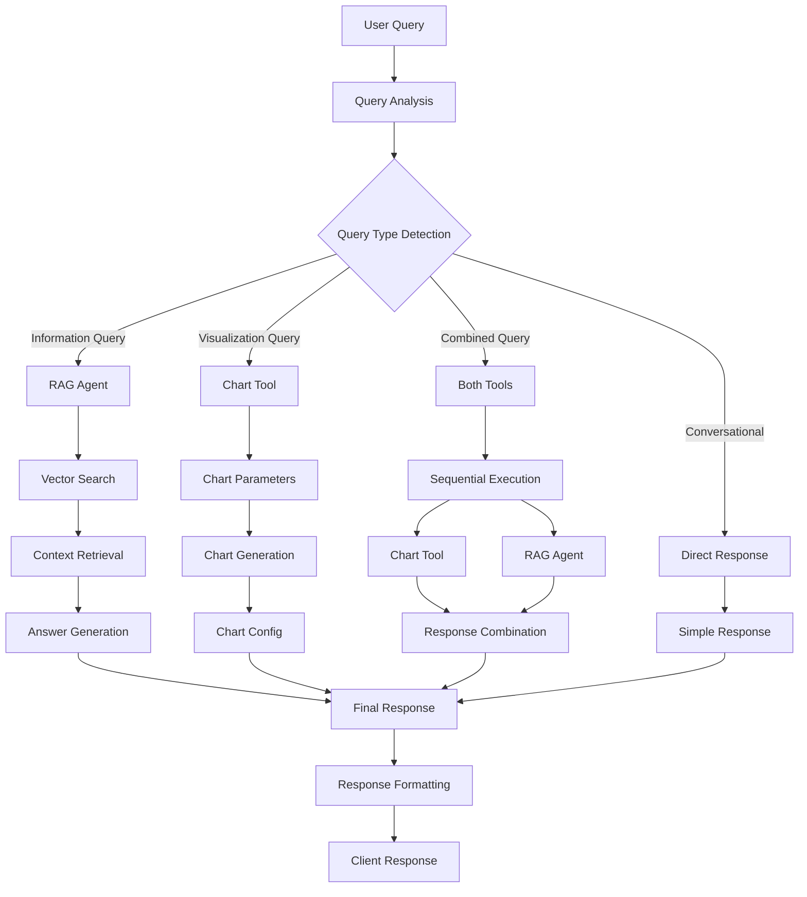

## 3. LangGraph State Machine

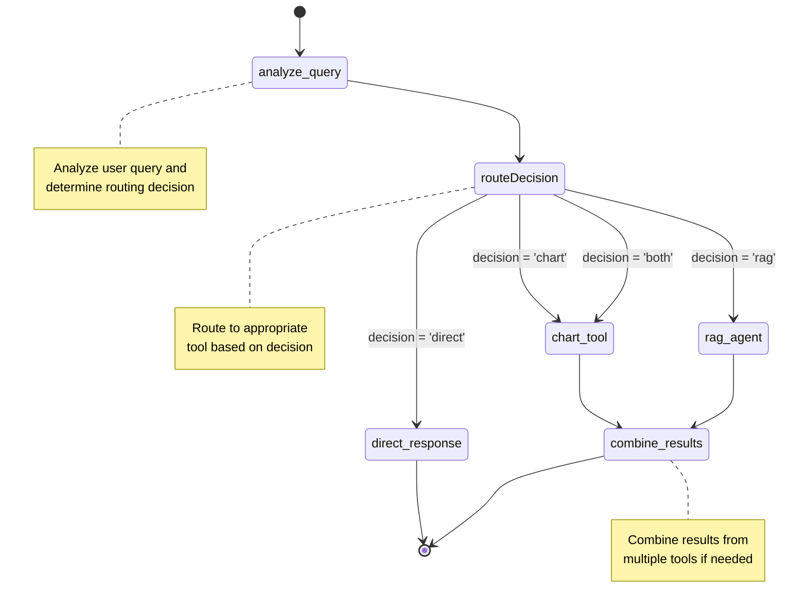

## 4. Database Schema Design

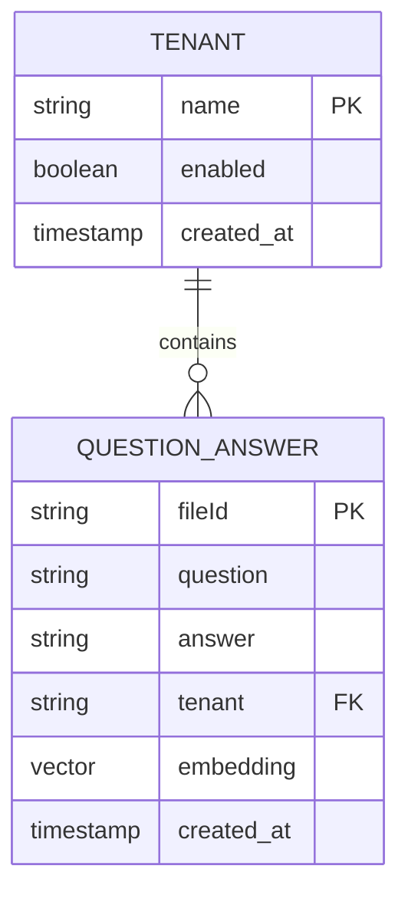

## 5. API Request/Response Flow

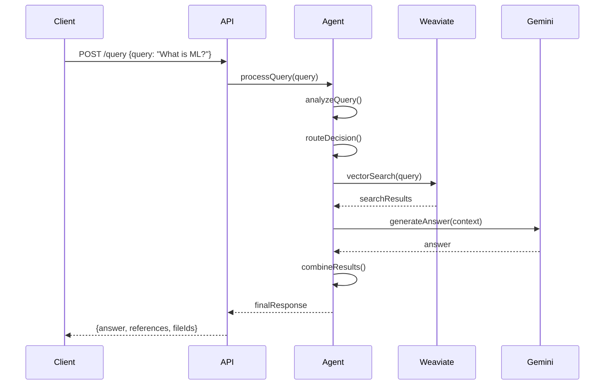

## 6. Error Handling Flow

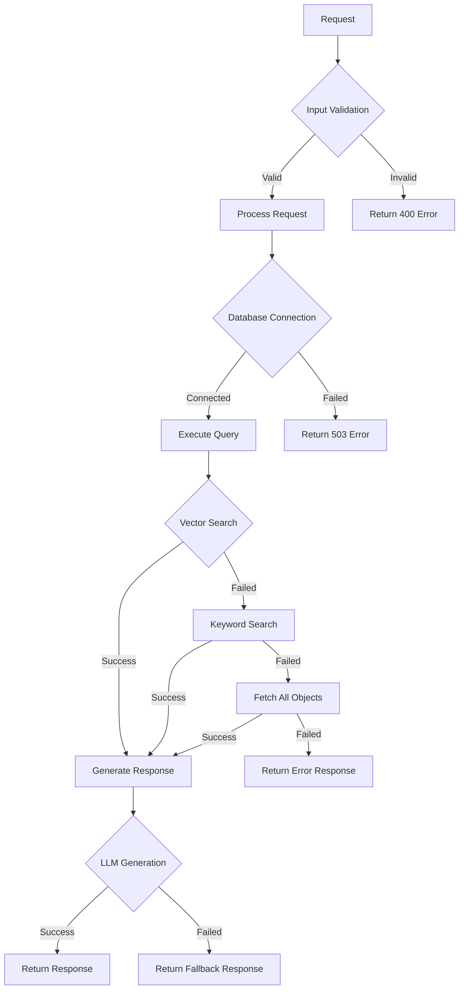

## 7. Deployment Architecture

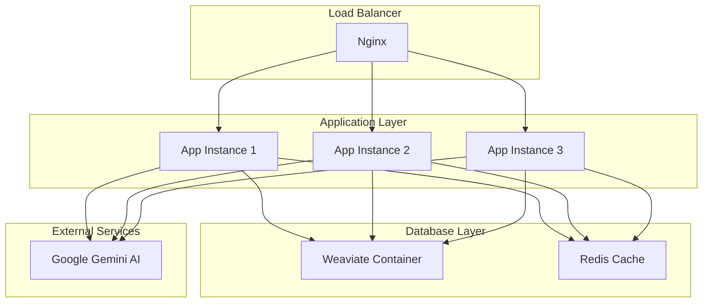

## 8. Data Flow Architecture

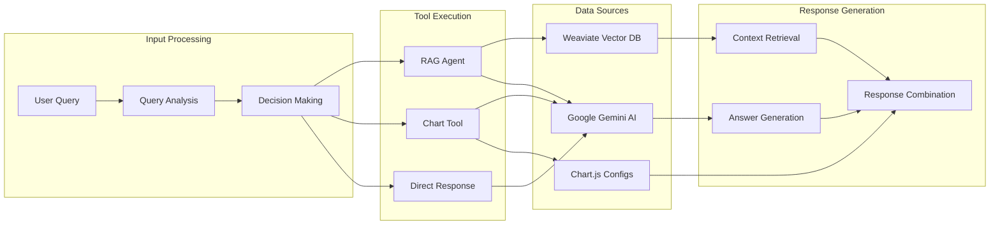

## 9. Security Architecture

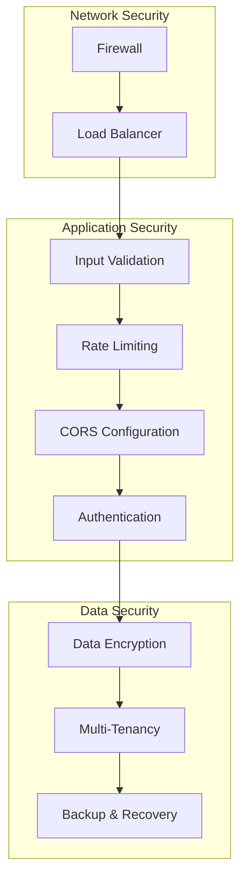

## 10. Monitoring and Observability

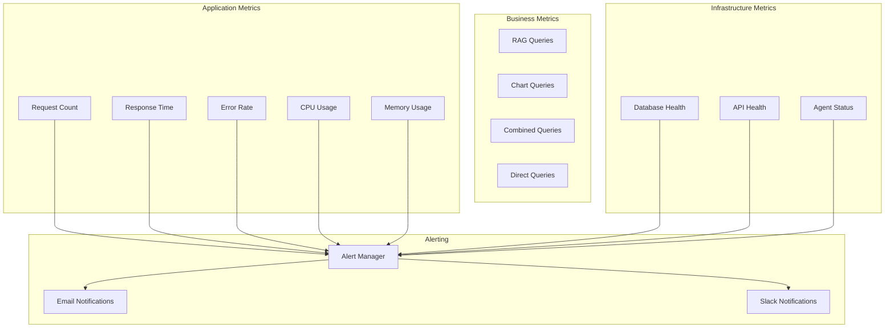

## 11. Performance Optimization Flow

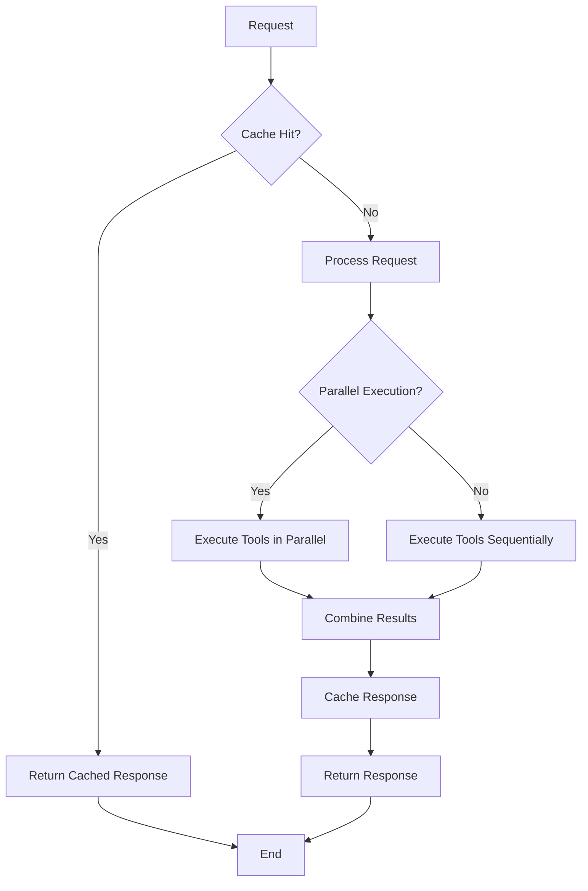

## 12. Component Interaction Matrix

| Component            | Delegating Agent | RAG Agent       | Chart Tool     | Weaviate | Gemini AI |
| -------------------- | ---------------- | --------------- | -------------- | -------- | --------- |
| **Delegating Agent** | -                | Calls           | Calls          | -        | Calls     |
| **RAG Agent**        | Returns Results  | -               | -              | Queries  | Calls     |
| **Chart Tool**       | Returns Results  | -               | -              | -        | Calls     |
| **Weaviate**         | -                | Returns Data    | -              | -        | -         |
| **Gemini AI**        | -                | Returns Answers | Returns Config | -        | -         |

## 13. Technology Stack Visualization

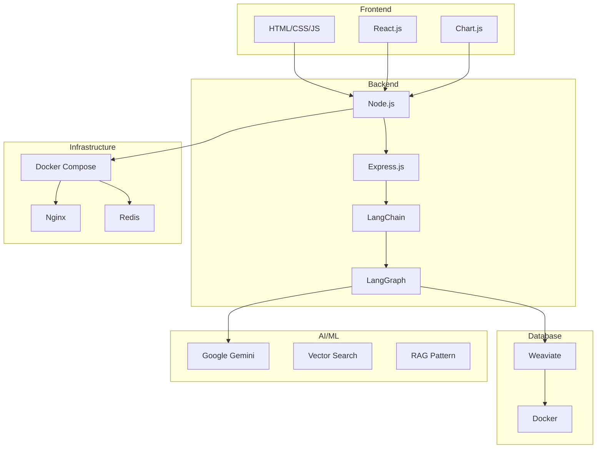

These diagrams provide a comprehensive visual representation of the LangChainPro system architecture, helping senior developers understand the complex interactions and design decisions made in the project.

